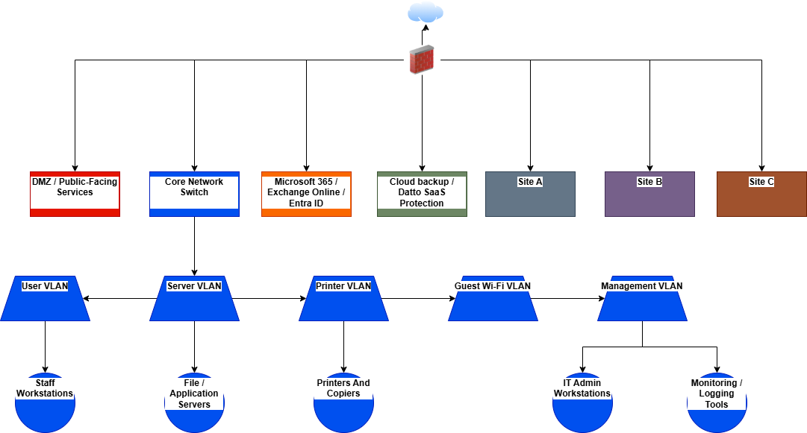

<<<<<<< HEAD
# Secure Enterprise Network Design

## Overview
This project demonstrates the design of a secure enterprise network architecture focused on protecting internal systems while maintaining public-facing service availability.

The design applies defense-in-depth, network segmentation, access control, firewall placement, and secure communication principles to reduce risk and improve overall security posture.

## Network Diagram

## Objectives
- Design a secure and reliable enterprise network architecture
- Protect internal systems and sensitive data
- Maintain availability for public-facing services
- Reduce risk through segmentation and access control
- Support business continuity and secure operations

## Architecture Summary
The proposed network separates systems into security zones, including a public-facing area, internal network, server environment, and management segment. This structure helps limit unauthorized access and reduce lateral movement if one area is compromised.

## Security Concepts Used
- Network Segmentation
- Defense-in-Depth
- Access Control
- Firewall Rules
- DMZ Architecture
- Risk Management
- Business Continuity
- Secure Network Design

## Skills Demonstrated
- Network Security Architecture
- Security Documentation
- Risk-Based Design
- Infrastructure Planning
- Technical Writing
- Cybersecurity Best Practices

## Project Files
- `/diagrams` - Network topology and architecture diagrams
- `/documentation` - Written security architecture and project notes
- `/assets/screenshots` - Supporting screenshots or visuals
=======
# secure-enterprise-network-design
Project for my resume. 
>>>>>>> 4c6dfa95ac94c73637f353ecaff974d86d5b4ff8
